# 🏠 Homepage Data Requirements

This page outlines all API calls required to render the homepage grid for the F1Connect app. These will fetch key data like current drivers, teams, recent race sessions, and F1 video content to give users a quick overview of what's happening in Formula 1.

---

## ✅ Required API Endpoints

Each endpoint listed below returns a **sample of 1 item** (via `limit=1`) to keep the homepage lightweight and fast.

---

### 1. 🏎️ Current Drivers

- **Purpose**: Show a featured/current driver in the homepage grid.
- **API Call**:

```http
GET https://f1connectapi.vercel.app/api/drivers?limit=1&offset=20
```

- **Note**: Offset can be adjusted to rotate drivers over time.

---

### 2. 🏁 Current Teams

- **Purpose**: Show a featured team.
- **API Call**:

```http
GET https://f1connectapi.vercel.app/api/teams?limit=1&offset=70
```

- **Note**: Offset can be adjusted to rotate featured teams.

---

### 3. 🏆 Latest Race Weekend Data

- **Purpose**: Pull the most recent Free Practice 1 session.
- **API Call**:

```http
GET https://f1connectapi.vercel.app/api/2024/1/fp1?limit=1
```

- **Note**: This pulls session data for Round 1 of 2024. In the future, this will become dynamic (e.g., current round).

---

### 4. 📅 Season Overview

- **Purpose**: Fetch metadata about the 2024 F1 season (used to guide the "Race Reviews" section).
- **API Call**:

```http
GET https://f1connectapi.vercel.app/api/2024
```

- **Returns**: Info about all 2024 races — race names, dates, round numbers.

---

### 5. 📺 Latest F1 Highlights (YouTube API)

- **Purpose**: Display most recent F1 highlights or interviews.
- **API Call**:

```http
GET https://www.googleapis.com/youtube/v3/search?part=snippet&channelId=UCB_qr75-ydFVKSF9Dmo6izg&maxResults=1&order=date&q=Formula+1+highlights&type=video&key=YOUR_YOUTUBE_API_KEY
```

- **Note**: This uses the official F1 YouTube channel. Replace `YOUR_YOUTUBE_API_KEY` with a valid key.

---

## 🧠 Frontend Structure

This data will populate a homepage grid with cards such as:

- 🏎️ Featured Driver
- 🏁 Featured Team
- 🏆 Race Review Highlight
- 📺 Latest Highlights

A footer will embed either the latest YouTube highlight or a live F1 tweet.

---

### 🖼️ Layout Overview (Mermaid Diagram)

```mermaid
flowchart TB
    subgraph Grid [Homepage Grid Layout]
        direction TB
        A1[🏎️ Current Drivers<br/>20 Active Drivers]
        A2[🏁 Teams<br/>10 Teams]
        B1[🏆 Race Reviews<br/>Latest GP Insights]
        B2[📺 Video Highlights<br/>Latest F1 Highlight]
    end

    Grid --> Footer[📣 Footer:<br/>Embedded YouTube Video<br/>or Live Tweet]

    style A1 fill:#f0f0f0,stroke:#555,stroke-width:1px
    style A2 fill:#f0f0f0,stroke:#555,stroke-width:1px
    style B1 fill:#f0f0f0,stroke:#555,stroke-width:1px
    style B2 fill:#f0f0f0,stroke:#555,stroke-width:1px
    style Footer fill:#fff8e1,stroke:#aaa,stroke-dasharray:5 5
```


